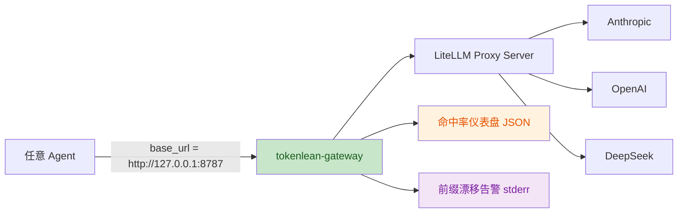

# 05 Gateway + 01–04 观测/CLI/多 Provider 补强设计

## 1. 设计目标

把 tokenlean-suite 从「四层实现 + 一层设计」补成完整可交付的五层产品：

- **05 gateway** 不再只是设计稿，而是开箱即用的 **LiteLLM 零代码代理** + 命中率看板。
- **01–04** 补强：
  - 01 workflow：`tl-audit` 支持真实 gateway 日志 + 多 provider + 多格式输出。
  - 02 mcp-server：补齐 OpenAI / DeepSeek provider 配置文档。
  - 04 prompt-assembler：`tl plan` 支持按 provider 生成对应 cache_control 格式。
- 新增 CLI 工具：`tl gateway start/status/logs`，统一入口 `tl.mjs` 扩展。

## 2. 05 Gateway 架构



### 2.1 核心交付物

| 文件 | 职责 |
| --- | --- |
| `05-gateway-design/config/litellm-cache-proxy.yaml` | LiteLLM 代理配置：router + `cache_control_injection_points` + 强制 `ttl=1h` |
| `05-gateway-design/lib/log-analyzer.mjs` | 解析 LiteLLM 标准 success logs，按 provider 提取命中/写入/未命中 tokens |
| `05-gateway-design/lib/drift-detector.mjs` | 维护最近 N 条请求的 system 前缀指纹，变化即告警 |
| `05-gateway-design/bin/http.mjs` | 真正的网关入口：可选包装 LiteLLM 或纯 Node fallback（预留接口） |
| `bin/tl-gateway.mjs` | CLI：`start` / `status` / `logs` / `config` |
| `05-gateway-design/test/test-gateway.mjs` | dry-run + log 解析 + drift 检测测试 |

### 2.2 LiteLLM 配置要点（零代码）

```yaml
model_list:
  - model_name: claude-sonnet-4-6
    litellm_params:
      model: anthropic/claude-sonnet-4-6
      api_key: os.environ/ANTHROPIC_API_KEY
      cache_control_injection_points:
        - "messages":
            - type: system
            - type: last_user_message
      ttl: 3600
  - model_name: gpt-4o
    litellm_params:
      model: openai/gpt-4o
      api_key: os.environ/OPENAI_API_KEY
      cache_control_injection_points:
        - "messages":
            - type: system
      ttl: 3600
  - model_name: deepseek-chat
    litellm_params:
      model: deepseek/deepseek-chat
      api_key: os.environ/DEEPSEEK_API_KEY
      cache_control_injection_points:
        - "messages":
            - type: system
      ttl: 3600

general_settings:
  success_callback: ["langfuse"]   # 可选；默认本地日志即可
  port: 8787
```

> 说明：LiteLLM 的 `cache_control_injection_points` 语法以实际 release 为准；本文件按设计意图提供，启动前由 CLI 校验。

### 2.3 CLI 语义

```bash
# 生成并启动 LiteLLM 代理
tl gateway start --port 8787 --provider anthropic

# 检查代理健康
 tl gateway status --port 8787

# 分析最近 N 条 LiteLLM 日志，输出命中率
 tl gateway logs --lines 100 --format json

# 生成配置文件不启动
 tl gateway config --provider openai --out ./litellm.yaml
```

## 3. 01–04 补强设计

### 3.1 01-workflow：真实命中率观测

- `01-workflow/claude-code/lib/hit-rate.mjs` 新增：
  - `analyzeGatewayLogs(path)` — 解析 LiteLLM success logs（JSONL）。
  - `analyzeOpenAI(usage)` / `analyzeDeepSeek(usage)` — provider-specific usage 字段映射。
- `bin/tl-audit.mjs` 新增选项：
  - `--provider all|anthropic|openai|deepseek`
  - `--format text|json|csv|html`
  - `--gateway-logs <dir>`

### 3.2 02-mcp-server：provider 配置文档

- 新增 `02-mcp-server/configs/openai.md`
- 新增 `02-mcp-server/configs/deepseek.md`
- 更新 `02-mcp-server/configs/claude-code.md`（上一轮已修正入口为 `tokenlean.mjs stdio`）

### 3.3 04-prompt-assembler：多 provider 断点布局

- `04-prompt-assembler/cli.mjs` 新增 `--provider anthropic|openai|deepseek`。
- `lib/assembler.mjs` 的 `assemble()` 根据 provider 输出不同格式的 `cache_control` 字段：
  - Anthropic：`{"type": "ephemeral"}`（LiteLLM 会转 `ttl`）
  - OpenAI：`{"type": "temporary"}`
  - DeepSeek：对象结构按 DeepSeek 文档映射

## 4. CLI 统一入口扩展

`bin/tl.mjs` 增加 `gateway` 分支，与 `tl-audit`、`tl-plan` 等并列。

## 5. 测试策略

- **新增测试**：`05-gateway-design/test/test-gateway.mjs`（约 20–25 断言）覆盖 log 解析、drift 检测、CLI 参数解析。
- **回归测试**：原有 338 断言必须全部通过。
- **集成验证**：
  - `tl gateway config --provider anthropic` 生成合法 YAML。
  - `tl gateway logs` 对 mock 日志输出预期命中率。
  - `tl audit --format json --provider openai` 输出合法 JSON。
  - `tl plan --provider anthropic` 输出 Anthropic 格式断点。

## 6. 设计约束

- 不引入 LiteLLM 作为 npm 依赖：用户在本地 `pip install litellm[proxy]` 或 Docker 运行；CLI 只负责生成配置和调用子进程。
- 保持零运行时依赖：`05-gateway-design/lib/` 只使用 Node 内置模块。
- 不要破坏已有 API：`lib/hit-rate.mjs` 的 `analyze(path)` 签名保持不变，仅新增导出函数。
- 退出码：`tl-gateway.mjs` 子进程必须透传 exit code（与 `tl-mcp.mjs` 模式对齐）。
